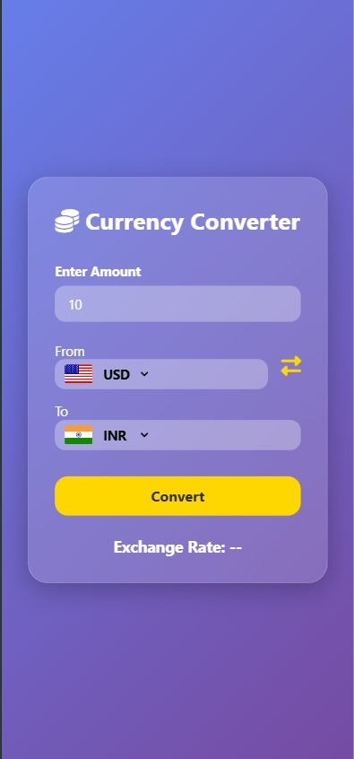
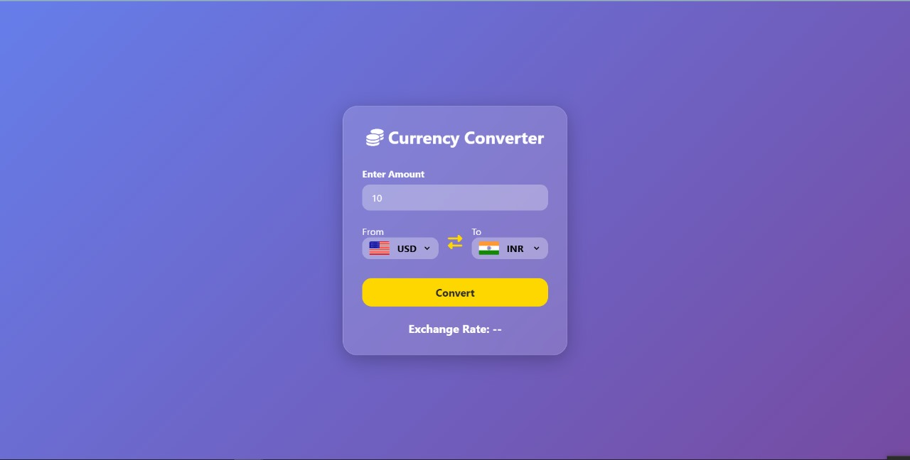

# Currency Converter


A modern, responsive Currency Converter web app that fetches real-time exchange rates using a public API. Easily convert between currencies with visual flag support and intuitive UI. Built with HTML, CSS, and JavaScript – no frameworks, just clean and functional code.

## Features
- Live exchange rates using a public API.
- Flags update dynamically based on selected currencies.
- Swap currencies quickly for reverse conversion.
- Handles invalid or empty input smoothly by defaulting to 1.

## Screenshots
<div>
  
  
</div>

## 👩‍💻 Technologies Used
- HTML5
- CSS3
- JavaScript
- Public Api: `https://cdn.jsdelivr.net/npm/@fawazahmed0/currency-api@latest/v1/currencies`

## 🚀 Getting Started
### Installation
1. Clone the repository:
     ```
     https://github.com/Sudhir302/Currency-Converter.git
2. Navigate to the project directory:
     ```
     cd Currency-Converter
3. Run the app: _Go Live_

## 📄 License
This project is licensed under the MIT LICENSE - see the [MIT License](./LICENSE) for details.
## Contact
Sudhir Chaudhary - csudhir302@gmail.com
